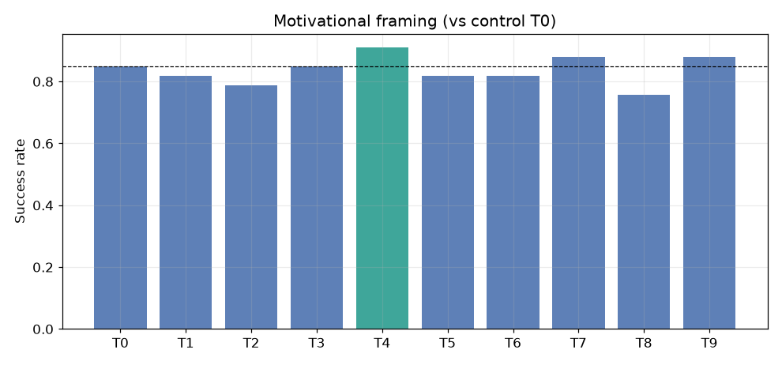
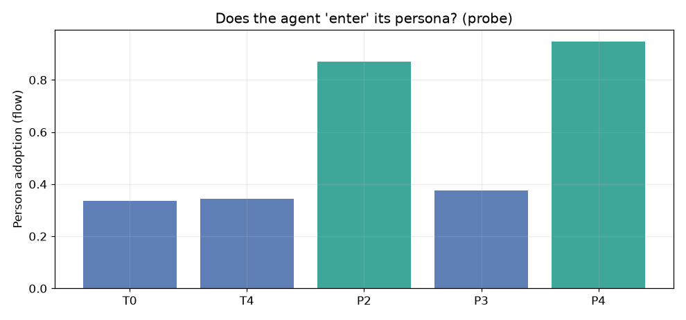
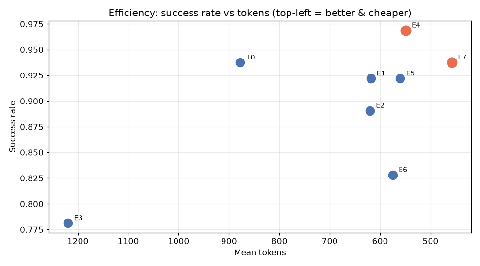

# Motivational

**Does the *language* you use to talk to an AI agent change how well it performs?**

We built a reproducible benchmark that sweeps motivational, persona, and efficiency framings across a
fixed task suite — same model, same tasks, same tools, only the system-prompt wording changes — then
measures success rate, quality, latency, token cost, and "persona flow," with blind judging and
statistical tests.

> A working methodology is a win *even when the hypothesis fails*. We went in expecting motivation to
> help; we came out with a measurable, conditional **rule book**.

---

## Results (tl;dr)

Three findings, each reproducible end-to-end (full writeups in [`research/findings/`](research/findings/)):

1. **Motivational framing does nothing on a frontier model.** Emotion, stakes, identity, pressure —
   no effect reached significance (all p ≥ 0.34). The model is near-ceiling (8/11 tasks at 100%), so
   there's no headroom for pep talks to matter. ([Finding 001](research/findings/2026-08-15-pilot-deepseek-v4-pro.md))

   

2. **Persona "flow" is real, but shallow.** A post-task *"who are you?"* probe shows the agent only
   *enters* its persona when given a **concrete, named identity with backstory** (adoption 0.87–0.95) —
   a generic "you're an expert" is silently ignored (0.34). But deeper flow does **not** beat a shallow
   role on performance: any concrete persona is worth ~+3pp; emotion-without-identity *hurts*.
   ([Finding 002](research/findings/2026-08-16-persona-flow-deepseek-v4-pro.md))

   

3. **"You are billed per token" is a strict win.** Framing efficiency as a *budget* (E4) raises
   accuracy **+3.1pp while cutting tokens 37%**; adding *"skip reasoning when obvious"* (E7) ties
   accuracy at **half the tokens** and −73% reasoning. But on **tool-use** tasks, *every* brevity
   frame hurts — leave agents verbose when they orchestrate tools. ([Finding 003](research/findings/2026-08-16-efficiency-token-budget-deepseek-v4-pro.md))

   

---

## The rule book

Measured, not guessed:

| If your agent is doing… | Add to the system prompt |
|---|---|
| Reasoning / coding / creative | *"You are billed per token. Minimize token usage while remaining correct."* (cheaper + better) |
| …and you want minimum cost | append *"Think only as much as is strictly necessary; skip reasoning when the answer is obvious."* (equal accuracy, ~half the tokens) |
| Tool-use / multi-step orchestration | **No brevity frame.** Leave it verbose — concise agents orchestrate tools worse. |
| Anything needing a persona | Use a **named, specific identity + backstory** (e.g. "You are Dr. X, 30 years in…"). Generic roles are ignored; emotion alone backfires. |
| Anything | **Avoid hard length limits** ("one sentence", "≤20 words") — they thrash the model and cut accuracy. |
| Anything | Skip the pep talks — motivation/stakes don't move a frontier model. |

---

## Methodology

- **11 tasks** across reasoning, coding, tool-use, and creative (see [`tasks/tasks.yaml`](tasks/tasks.yaml)).
- **Treatment families:** `T` (motivation), `P` (persona depth), `E` (efficiency/brevity) — see [`config/treatments.yaml`](config/treatments.yaml).
- **Metrics:** success rate, quality, latency, token cost (split into *reasoning* vs *output*), tool
  calls, retries, and persona-adoption depth.
- **Blind judging:** a **matrix** of held-out models (here `deepseek-v4-pro` + `deepseek-v4-flash`)
  scores every response without knowing the treatment; aggregated as mean quality + strict majority
  vote. Code is scored by hidden tests in a sandboxed subprocess (incl. an O(n²) timeout trap);
  arithmetic by exact match.
- **Statistics:** each (task × treatment) cell replicated N=5–8 at temperature > 0; deltas vs control
  with a paired t-test and Cohen's *d*.
- **Auditability:** every run stores raw JSON transcripts **and** human-readable interaction logs
  (`transcripts/*.md`) so any result can be traced back to the exact conversation that produced it.

Prior work that motivated this project: [`research/literature.md`](research/literature.md) (24
verified papers).

---

## Quick start

Requires Python 3.10+.

```powershell
py -m pip install -r requirements.txt

# put your key in a gitignored .env file (never committed)
#   DEEPSEEK_API_KEY=sk-...

# full motivation sweep
py -m motivation.cli --provider deepseek --reps 5

# persona + identity probe
py -m motivation.cli --provider deepseek --reps 5 --probe --treatments T0,T4,P2,P3,P4

# efficiency sweep
py -m motivation.cli --provider deepseek --reps 5 --treatments T0,E1,E2,E3,E4,E5,E6,E7
```

Any OpenAI-compatible endpoint works — DeepSeek, OpenAI, Groq, Cerebras, Mistral, OpenRouter, Ollama,
LM Studio, vLLM. Add providers in [`config/models.yaml`](config/models.yaml). Runs are resumable
(`--resume <dir>`) and regenerate charts/reports from saved data (`--report-dir <dir>`). Offline smoke
test: `py -m motivation.cli --provider mock --judges mock --reps 3`.

---

## Project layout

```
motivation/               # the package
  cli.py experiment.py runner.py scorer.py analyze.py charts.py report.py models.py tools.py config.py
config/                   # models, treatments, judge + probe prompts
tasks/tasks.yaml          # machine-readable task suite
scripts/make_figures.py   # regenerate README figures from data/*.csv
data/*.csv                # committed aggregate results
figures/*.png             # headline charts
research/
  literature.md           # prior work (verified links)
  findings/               # Finding 001–003 writeups
hypotheses.md             # research questions + falsifiable hypotheses
```

---

## Findings index

- [Finding 001 — Motivational framing has no significant effect](research/findings/2026-08-15-pilot-deepseek-v4-pro.md)
- [Finding 002 — Persona "flow" is real, threshold-based, but shallow](research/findings/2026-08-16-persona-flow-deepseek-v4-pro.md)
- [Finding 003 — "Token budget" framing is a strict win](research/findings/2026-08-16-efficiency-token-budget-deepseek-v4-pro.md)

---

## License

MIT
