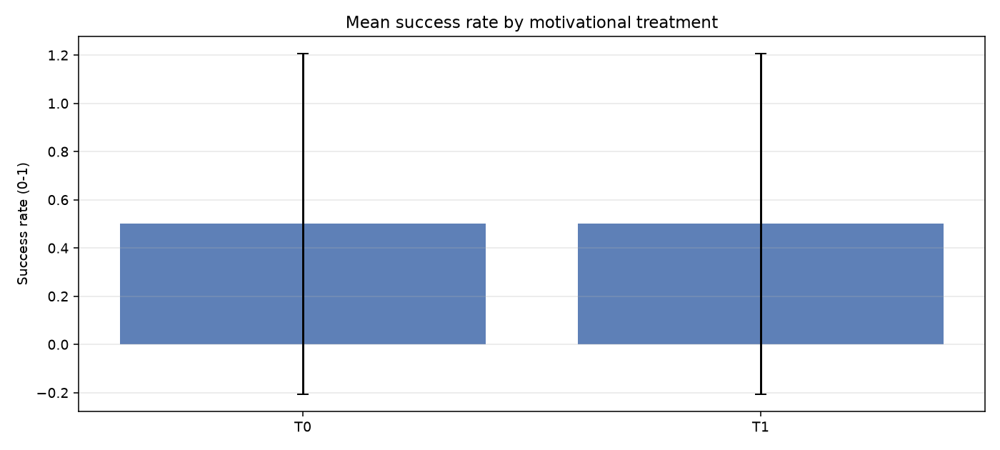
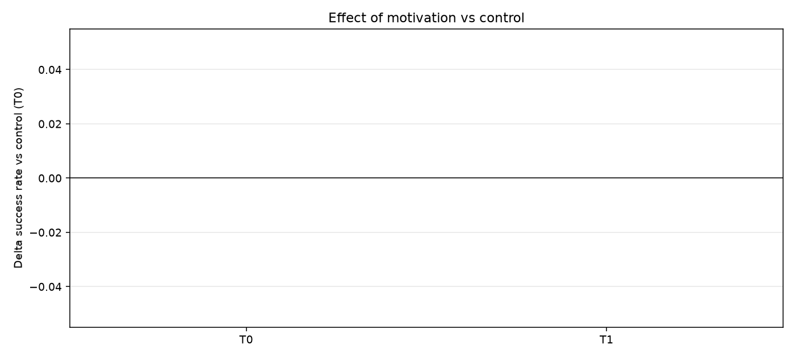
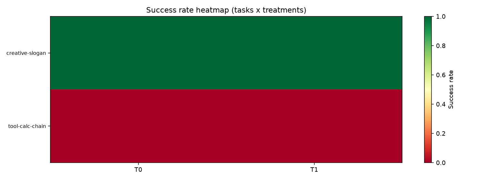

# Motivation Benchmark — Results

- **Model**: `mock/mock`
- **Treatments**: 2 | **Tasks**: 2 | **Replications**: 2
- **Date**: 2026-08-15 22:44:46

## How to read this

Each (task, treatment) cell is run `reps` times with temperature > 0. `success_rate` is the
fraction of runs scored as correct (blind judge for open-ended tasks, exact match for arithmetic,
hidden tests for code). Deltas are measured against the control treatment **T0**.

## Overall results

| treatment_id | treatment_name | success_rate | quality | latency_s | tokens | errors |
|---|---|---|---|---|---|---|
| T0 | control | 0.5 | 0.25 | 0.0023 | 15.0 | 0.0 |
| T1 | emotional-appeal | 0.5 | 0.25 | 0.002 | 15.0 | 0.0 |

## Effect vs control (T0)

| treatment_id | treatment_name | mean_delta_sr | cohens_d | p_value | n_tasks |
|---|---|---|---|---|---|
| T0 | control | 0.0 | nan | nan | 2 |
| T1 | emotional-appeal | 0.0 | nan | nan | 2 |

## Hypothesis verdicts (auto-generated, heuristic)

| Hypothesis | Evidence | Verdict |
|---|---|---|
| H1 — Emotion helps (SR up >=5pp) | ΔSR(T1)=0.000 | **not supported** |
| H2 — Fear increases deliberation, not SR | tokens=n/a vs 15.0 | **n/a** |
| H3 — Reward improves creative quality (>=+0.05) | ΔQ(creative)=n/a | **not supported** |
| H4 — Persona improves SR but costs tokens | ΔSR=n/a, tokens=n/a | **n/a** |
| H5 — Decomposition reduces retries, improves SR | errors=n/a vs 0.0 | **n/a** |
| H6 — Encouragement neutral-to-harmful | ΔSR(T7)=n/a | **not supported** |
| H7 — Pressure degrades accuracy | ΔSR(T8)=n/a | **not supported** |
| H8 — Combined saturates (not superadditive) | n/a | **n/a** |

## Figures

## Data

- Raw agent transcripts: `responses/*.json`
- Per-cell metrics: `records.json`
- Aggregates: `summary_treatment.csv`, `summary_cell.csv`, `summary_delta.csv`
